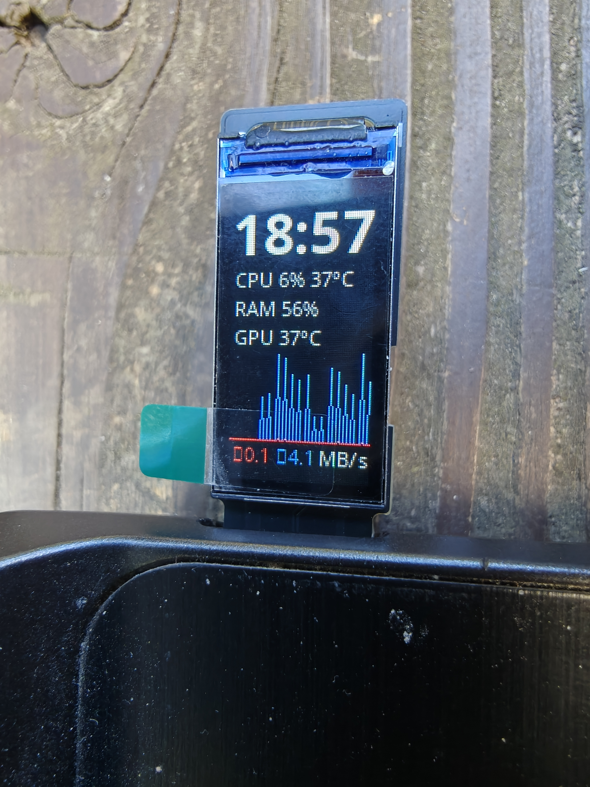

# fs-display-steamos

System monitor for the WeAct 0.96" FS USB display on Steam Deck. Shows a clock, CPU/RAM/GPU stats, and a live network graph.



## What it shows

- 24h clock (HH:MM)
- CPU usage % and temperature
- RAM usage %
- GPU temperature
- Network upload/download graph with speed readout

## Install

Open a terminal on your Steam Deck (desktop mode) and run:

```bash
wget -qO- https://raw.githubusercontent.com/qwaxys/fs-display-steamos/main/install.sh | bash
```

This will:

- Install any missing system packages (python, git)
- Clone this repo and the display driver library
- Set up a Python virtual environment with dependencies
- Install a udev rule and systemd service for automatic start/stop
- Preserve config files across SteamOS updates

After installation, plug in the display and it starts automatically.

## Manual control

```bash
sudo systemctl start weact-display
sudo systemctl stop weact-display
sudo systemctl status weact-display
```

## Hardware

- [WeAct 0.96" FS USB Display](https://aliexpress.com/item/1005009941797169.html) (80x160, USB VID `1a86` PID `fe0c`)

## Software

- Uses [turing-smart-screen-python](https://github.com/mathoudebine/turing-smart-screen-python) as the display driver

## Uninstall

```bash
~/fs-display-steamos/uninstall.sh
```
